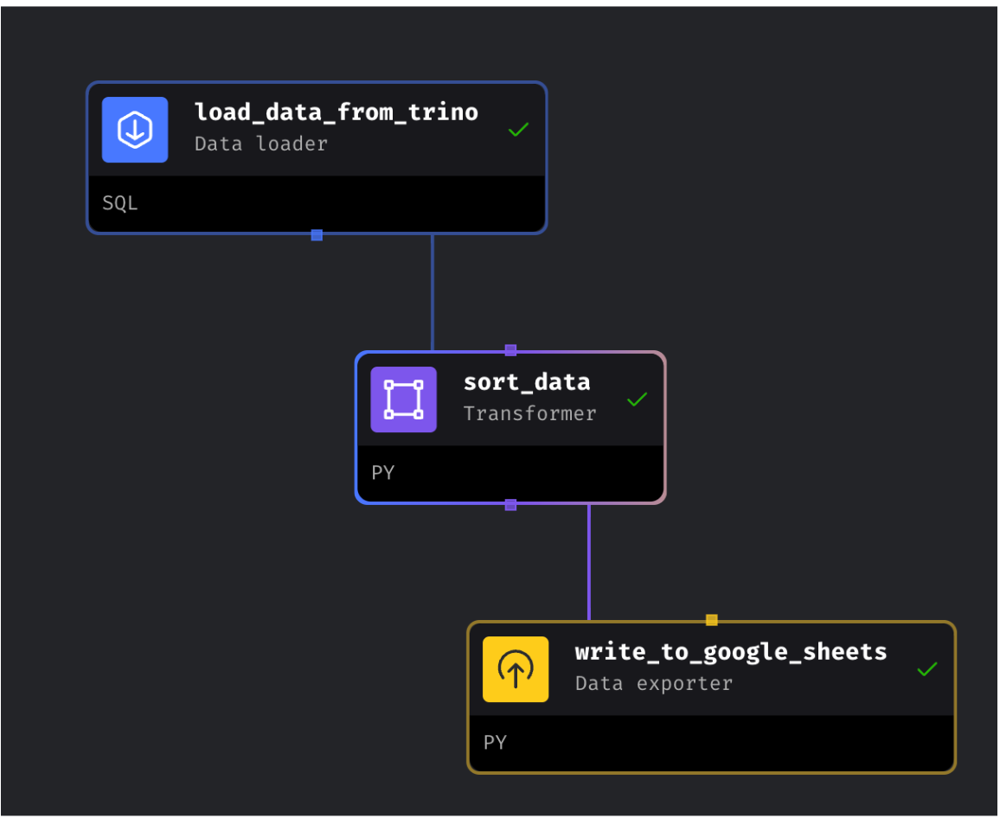

# Mage-AI Exploration

This repository demonstrates the exploration of mage-ai, a modern data pipeline tool that combines notebook flexibility with production-grade modularity.

## Overview

[Mage-AI](https://docs.mage.ai/introduction/overview) is a hybrid framework for data transformation and integration that offers:

- Notebook-style development experience
- Production-ready modular code structure
- User-friendly interface for data pipeline creation
- Rich ecosystem of connectors and transformations

## Real-world Use Case: Trino to Google Sheets Pipeline

This demo implements a data pipeline that:



1. Extracts data from Trino database
    - Connects to Trino using built-in SQL connector
    - Executes complex analytical queries
    - Handles data partitioning and pagination
    - Manages connection pooling efficiently

2. Transforms data (if needed)
    - Performs data normalization and standardization
    - Applies business logic transformations
    - Handles missing data and outliers
    - Implements data quality checks and validation rules
    - Maintains data lineage tracking

3. Loads data to Google Sheets
    - Uses OAuth2 authentication for secure access
    - Supports batch updates for performance
    - Implements retry mechanisms for reliability
    - Maintains version history of updates
    - Handles rate limiting gracefully

This pipeline enables business users to:
- Access real-time analytics data in familiar spreadsheet format
- Create dynamic dashboards and reports
- Set up automated alerts and notifications
- Track KPIs and metrics historically
- Share insights across teams securely

## How to Run This Demo

**Prerequisites**
- Docker and Docker Build installed
- Google Cloud Platform account with Sheets API enabled
- Trino cluster access credentials
- Python 3.10+ installed locally

**Step 1**: Clone this repository

```bash
git clone https://github.com/your-org/mage-ai-demo.git
cd mage-ai-demo

```

**Step 2**: Start the environment

```bash
make start
```

Access the UI at http://localhost:6789

**Step 3**: Configure connections
- Update credentials for Trino and Google Sheets from `io_config.yaml` file
- Verify connection settings

**Step 4**: Test pipeline execution
- Run individual blocks to verify transformations
- Execute end-to-end pipeline
- Validate output in Google Sheets

**Step 5**: Clean up resources

```bash
make stop
```
